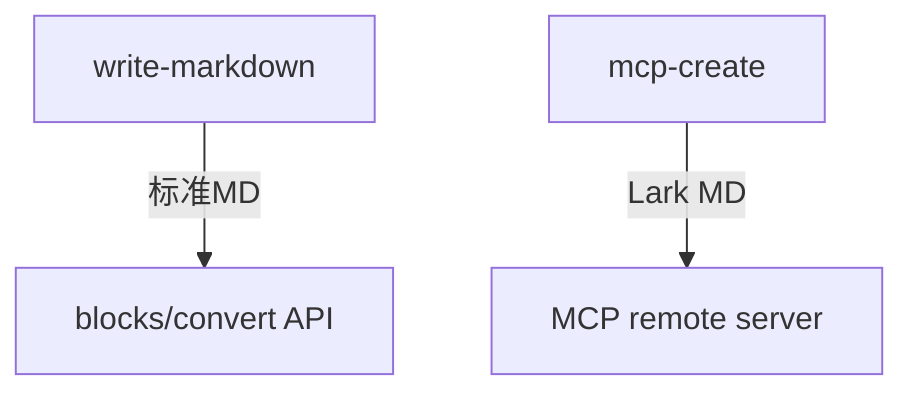

<callout emoji="💡" background-color="light-blue">
重要提示：这是通过 MCP 创建的文档
</callout>

## 功能对比

| 方式 | 支持语法 |
|------|----------|
| write-markdown | 标准 Markdown |
| mcp-create | Lark-flavored Markdown |

